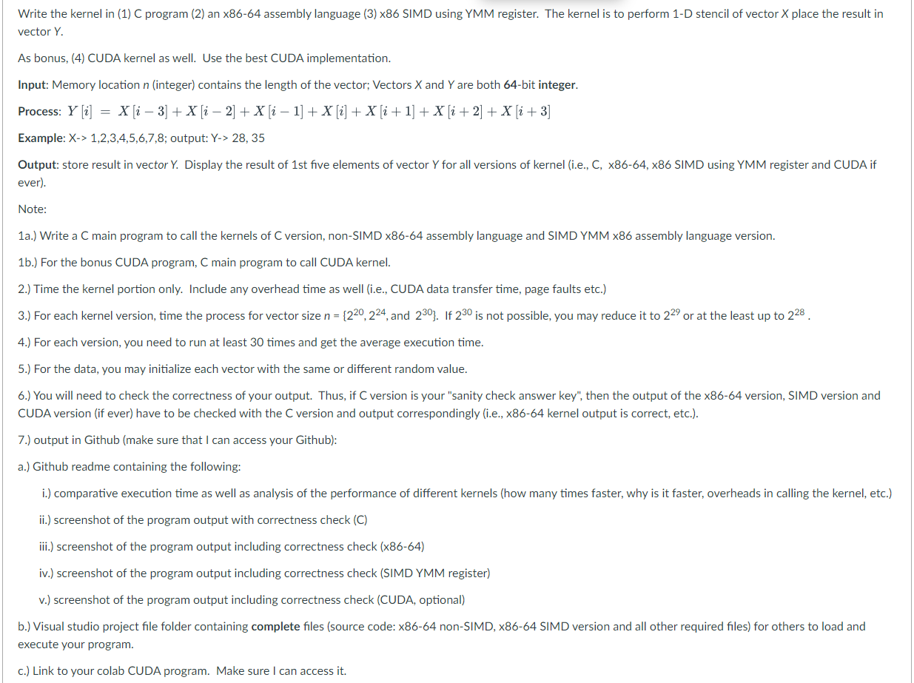

# 1D_stencil_SIMD

#### Author: ***HERNANDEZ**, Pierre Vincent*

## Project Specification

## Machine Specification:

Machine used for the development and running of this project:

- OS: Windows 11
- System type: 64-bit operating system, x64-based processor
- Processor: AMD Ryzen 7 5700U with Radeon Graphics (1.80 GHz)
- RAM: 8.00 GB (5.85 GB usable)
- Tools used:
    - Visual Studio 2022
    - Google Colaboratory

## Important Links

- GitHub Repository Link (for C, x86-64, and SIMD) [*[1D_stencil_SIMD][stencil_github]*]
- Google Colaboratory Link (for CUDA) [*[stencil_1D_CUDA][stencil_gcolab]*] 
(**Use DLSU email to access*)

## Comparative Analysis of the Performance of Different Kernels

### [Number of elements: 2^20] C vs. x86-64 vs. SIMD vs. CUDA

#### Debug Build (C, x86-64, & SIMD)

![2^20 Debug Build][2-20_debug]

Based on the average execution time in microseconds for the `Debug Build` of the C, 
x86-64, and SIMD version, it shows that the C version of the 1-D stencil implementation
is the slowest. It is followed by the x86-64 version, which is faster by approximately
4000uS or 4mS. SIMD shows to be the faster than its C and x86-64 version. Looking closely 
between the x86-64 version and SIMD version, SIMD is just approximately 200uS faster than 
the x86-64, which is not that noticeable expecially with these range of values.

#### Release Build (C, x86-64, & SIMD)

![2^20 Release Build][2-20_release]

Upon running the `Release Build` of the C, x86-64, and SIMD version, it appears that 
C and SIMD version was able to speed up their execution. While the x86-64, it slowed than
a bit compared to its `Debug Build`. It is also observed that certain optimizations that was 
done to the code produced some unpredicted behaviors. One example would be the `clock()` 
return value and reaction. There are times that the timer variables are not updating.

#### CUDA version

![2^20 CUDA version][2-20_cuda]

The CUDA version was able to surpass the execution time speed of the first three versions. 
Even with a total transfer time of 1400uS for the Y vector from host to device and vice 
versa, and adding the average execution time of 97.22uS, it is still much faster. It is 
also important to know that this is implemented and ran in the Google Colaboratory due to
the local machine used not having an external NVIDIA GPU. 

### [Number of elements: 2^24] C vs. x86-64 vs. SIMD vs. CUDA

#### Debug Build (C, x86-64, & SIMD)

![2^24 Debug Build][2-24_debug]

Increasing the vector size to `2^24`, the execution time difference between C, x86, and SIMD
is much more evident. C is still the slowest one, with x86-64 in the middle and SIMD being
the fastest.

#### Release Build (C, x86-64, & SIMD)

![2^24 Release Build][2-24_release]

Even in the `Release Build`, execution time difference is more evident than the previous 
`Release Build` when the number of elements is `2^20`.

#### CUDA version

![2^24 CUDA version][2-24_cuda]

By only looking at the exection time of the CUDA kernel responsible for the 1-D stencil
operation, it is extremely faster compared to the C, x86-64 and SIMD version. But it is 
also important to note that the data must be transfered from the host memory to the GPU 
memory for a computational operation. Combining the transfer and execution time, it totals 
to approximately 26mS. By comparing it to the `Debug Build` of the SIMD version, the SIMD
version is completely faster compared to the CUDA version.

### [Number of elements: 2^28] C vs. x86-64 vs. SIMD vs. CUDA

#### Debug Build (C, x86-64, & SIMD)

![2^28 Debug Build][2-28_debug]

The vector size was first increased to `2^30` and `2^29`, but it appears that the RAM of
the machine currently being used bottlenecks the program. Thus, it was decreased to `2^28`.
Even with the decrease of vector size it appears that there is paging happening in the 
system to be able to handle approximately 4GB of data. Difference between C and x86-64, 
abd between x86-64 and SIMD in the `Debug Build` is higher. This displays how fast is SIMD
operation is.

#### Release Build (C, x86-64, & SIMD)

![2^28 Release Build][2-28_release]

By using the `Release Build`, C and SIMD increased in execution speed, but unfortunately
for the x86-64 version it slowed down a bit.

#### CUDA version

![2^28 CUDA version][2-28_cuda]

Lastly, the CUDA version is still faster compared to the C and x86-64 version. But a bit 
faster than the SIMD version but close to it (especially when adding the total transfer 
time in CUDA).

It can be concluded that implementations in CUDA and SIMD is much faster compared to 
the vanilla C and x86-64. The `Release Build` in Visual Studio is somehow making the 
program built to be a bit quirky with its behavior. Additionally, since the comparison 
between the three versions (C, x86-64, and SIMD) and CUDA was done on a different machine 
there could be a possible future investigation on this. Lastly, the RAM of the machine used 
could've also bottleneck the pure performance of the said versions or implementations, which 
could be an interesting discovery if all of this are done in the same machine with the highest or lowest specs possible to see which and where they could fit best.

[stencil_github]: https://github.com/Pierre120/1D_stencil_SIMD "1D_stencil_SIMD"
[stencil_gcolab]: https://colab.research.google.com/drive/1MS1oXRuKYDnK4LBWSJgJSdjanqyH3arm?usp=sharing "stencil_1D_CUDA"
[2-20_debug]: ./screenshots/2-20_debug.png "2^20 Debug Build"
[2-20_release]: ./screenshots/2-20_release.png "2^20 Release Build"
[2-20_cuda]: ./screenshots/2-20_cuda.png "2^20 CUDA version"
[2-24_debug]: ./screenshots/2-24_debug.png "2^24 Debug Build"
[2-24_release]: ./screenshots/2-24_release.png "2^24 Release Build"
[2-24_cuda]: ./screenshots/2-24_cuda.png "2^24 CUDA version"
[2-28_debug]: ./screenshots/2-28_debug.png "2^28 Debug Build"
[2-28_release]: ./screenshots/2-28_release.png "2^28 Release Build"
[2-28_cuda]: ./screenshots/2-28_cuda.png "2^28 CUDA version"
